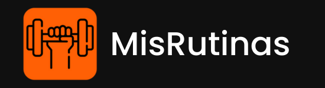

# MisRutinas 🧡🖤

Proyecto Integrador | Ciclo Lectivo 2023 Cohorte 2022.

Tecnicatura Superior en Desarrollo Web y Aplicaciones Digitales del Instituto Superior Politécnico de Córdoba

Bienvenidos ♥ **MisRutinas** es una página web fitness para administrar rutinas de entrenamiento, permitiendo un control detallado de los ejercicios cargados por el propio usuario y complementándolo con funcionalidades como calendario, calculadora de IMC, sistema de logros (con membresía), entre otros.

⚠ **Dentro de las carpetas "backend" y "frontend" se encuentran disponibles READMEs más detallados con instrucciones para la instalación de dependencias de las tecnologías utilizadas y la configuración de su entorno. Estos README te guiarán en el proceso paso a paso para asegurarte de tener todo lo necesario para ejecutar correctamente tanto el backend como el frontend del proyecto.**

### Developers 2022-2023 🤍

* [Esteban Martins](https://github.com/estebanmartins)
* [Federico Ocaranza](https://github.com/fede9087)
* [Carina Payleman](https://github.com/PaylemanC)
* [Facundo Peralta](https://github.com/facuezeperalta)
* [Horacio Eduardo Quiroga](https://github.com/horacioequiroga)
* [Verónica Silvina Torres](https://github.com/verofx)

### Integrantes previos* 🤍

* [Guillermo Arias](https://github.com/misterio07)
* [Florencia Rodriguez](https://github.com/FlorenciaRoux)
* [Silvina Eva Soria del Valle](https://github.com/Silvina-Dew)

*2022 y otros Sprints 2023.

### **STACK 2023 - eCommerce**

#### Frontend

* Node 18.12.1 (para Angular) 
* Angular CLI @15.2.6 
* TypeScript 4.9.4 

#### Backend & DB

* Django 4.2.1
* Django REST Framework 3.14.0
* MySQL con Django (*mysql-connector-python 8.0.29, mysqlclient 2.1.1*).

### **STACK 2022**

* HTML5.
* CSS3.
* JavaScript.
* MySQL.
* Python.
